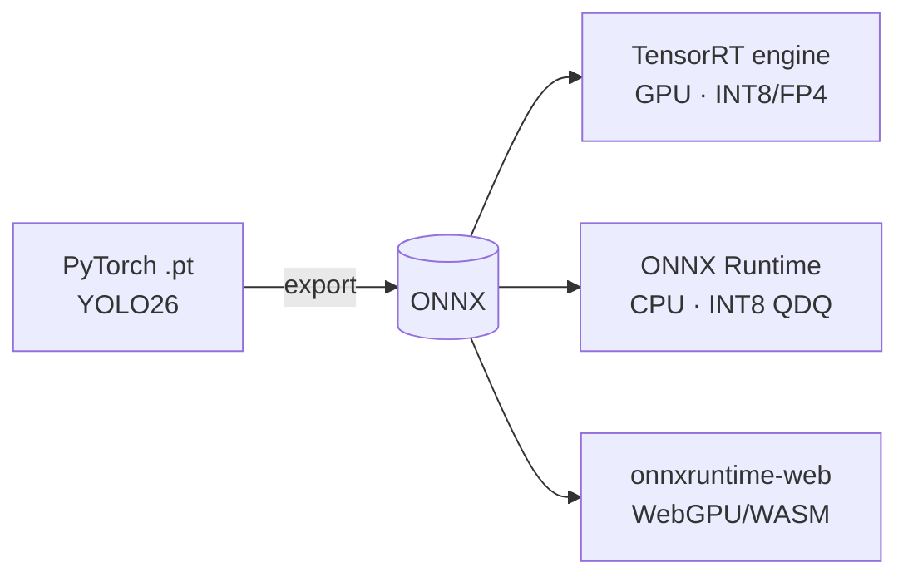

# Edge-First Real-Time Object Detection — YOLO26 → ONNX / TensorRT / WebGPU

Train a modern **NMS-free** object detector ([YOLO26](https://docs.ultralytics.com/models/yolo26),
Ultralytics, Jan 2026), then ship the **same** model to three runtimes and
quantify the accuracy / latency / energy trade-offs:

- **TensorRT (for RTX)** — desktop/server NVIDIA GPU, max throughput (INT8 / FP4)
- **ONNX Runtime** — portable CPU inference (QDQ INT8)
- **onnxruntime-web + WebGPU** — fully client-side, in-browser, privacy-preserving

## Research question

> *For a fixed mAP budget (≤ 2% drop from FP32), which export path gives the best
> latency-per-watt on (i) the GPU, (ii) the CPU, and (iii) WebGPU in Chrome?*

## Pipeline



## Target hardware

| Component | Spec |
| :--- | :--- |
| CPU | AMD Ryzen 7 7700 (8c/16t, Zen 4, AVX-512) |
| GPU | NVIDIA RTX 5070, 12 GB GDDR7 — **Blackwell GB205**, compute capability 10.0 |
| RAM | 32 GB DDR5 |
| OS | Windows 11 + PowerShell 7 |

## Repository layout

```
edge_yolo26_deployment/
├── code/                     # all source
│   ├── training/             # YOLO26 fine-tuning
│   ├── export/               # PyTorch → ONNX
│   ├── tensorrt_inference/   # TensorRT engine build + inference
│   ├── onnxruntime_inference/# CPU inference + INT8 quantization
│   └── web_demo/             # WebGPU browser demo (onnxruntime-web)
├── data/                     # datasets — gitignored (large/regenerable)
├── models/                   # weights & engines — gitignored
├── results/                  # benchmark logs & plots — gitignored
└── scripts/                  # download / preprocess / utility scripts
```

> **Note:** `data/`, `models/`, and `results/` contents are gitignored — they hold
> large or regenerable artifacts (only an empty `.gitkeep` is tracked). Personal
> study notes are kept locally and not tracked.

## Status

| Phase | Folder | State |
| :--- | :--- | :--- |
| Setup & environment | — | ✅ documented |
| Theory & architecture | — | ✅ documented |
| Dataset & training | `code/training` | ⏳ |
| ONNX export | `code/export` | ⏳ |
| TensorRT deployment | `code/tensorrt_inference` | ⏳ |
| ONNX Runtime (CPU) | `code/onnxruntime_inference` | ⏳ |
| WebGPU browser demo | `code/web_demo` | ⏳ |
| Benchmarking & analysis | `results` | ⏳ |

## Success criteria

- ≥ **2× speedup** TensorRT-INT8 vs PyTorch-FP32 at **≤ 2% mAP@50-95 loss**
- Full FP32/FP16/INT8 × {GPU, CPU, WebGPU} comparison table (mAP, ms, FPS, W)
- A live WebGPU demo page running entirely client-side
- A latency-per-watt analysis naming the winning path per device

## Quick start

```powershell
conda create -n yolo26 python=3.11 -y; conda activate yolo26
pip install torch torchvision --index-url https://download.pytorch.org/whl/cu128
pip install ultralytics onnx onnxslim onnxruntime nvidia-modelopt
yolo checks
```

See `code/` subfolders for per-phase instructions (added as the project progresses).

## License

MIT (see `LICENSE`).
