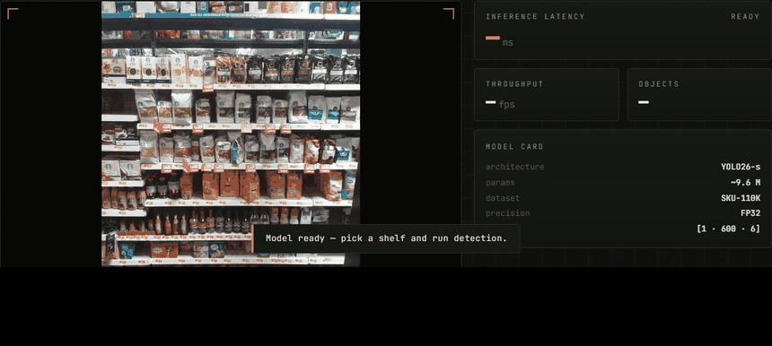
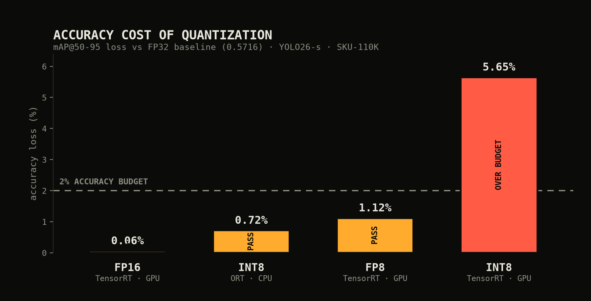

<div align="center">

# EDGE // YOLO26
### An empirical study of single-model, multi-runtime edge deployment

**One trained detector → TensorRT (GPU) · ONNX Runtime (CPU) · WebGPU (browser) — with the accuracy/latency trade-off of every export path measured under a controlled protocol.**




*Dense retail-shelf detection running **100% in the browser** on WebGPU — ~140 products localized per frame, no upload, no server, no API.*

</div>

---

## Abstract

Model training is a small fraction of the work required to *deploy* a detector; the export,
quantization, and runtime-selection steps are where accuracy and latency are actually won or
lost, and they are rarely measured rigorously. This project fine-tunes a modern NMS-free detector
(**YOLO26-s**) on a dense retail-shelf benchmark (**SKU-110K**, ~150 objects/image) to a baseline
of **mAP@50-95 = 0.572**, exports a single canonical ONNX graph, and deploys it to three runtimes
across four numeric precisions. Holding the model, input size, and detection cap fixed so that
**precision is the only independent variable**, we measure the accuracy cost of each quantization
path against a 2% budget and the CPU latency of the INT8 path. The headline findings: **FP8
retains accuracy 8× better than INT8 at a comparable bit-width**, and **"INT8" is not one thing** —
the same nominal precision loses 5.65% mAP on TensorRT but only 0.72% on ONNX Runtime, a
difference fully explained by per-channel granularity and detection-head handling. We report
negative results honestly, including a reproducible toolchain wall that blocks NVFP4 on the test
platform.

**Study status.** The *accuracy* dimension is complete across all runtimes/precisions. The
*latency* dimension is complete for the CPU runtime; GPU engine latency and per-watt energy — the
remaining half of the guiding research question — are **not yet measured** and are stated as
future work (§7). Claims are scoped accordingly throughout.

---

## 1. Motivation & research question

Edge deployment forces a real trade: lower numeric precision buys speed, memory, and energy at
some cost in accuracy — but *how much*, and *which path is best*, depends on the runtime, the
hardware, and the model's own sensitivity. The guiding question:

> **RQ.** For a fixed accuracy budget (**≤ 2% mAP@50-95 drop** from FP32), which export path gives
> the best latency-per-watt on (i) a server-class GPU, (ii) a desktop CPU, and (iii) WebGPU in the
> browser?

This report answers the **accuracy-budget** component in full and the **CPU-latency** component in
part; the GPU-latency and energy components are scoped as future work (§7).

---

## 2. Experimental setup

**Model.** YOLO26-s (NMS-free, end-to-end head emitting `[1, 600, 6]`), fine-tuned from
COCO-pretrained weights.

**Dataset.** [SKU-110K](https://arxiv.org/abs/1904.00853) — 11,743 images, ~1.7M boxes, single
class, **~150 objects/image** (peaks past 600). Chosen deliberately: dense, near-identical, touching
objects are the worst case for NMS and therefore the most diagnostic setting for an *NMS-free*
detector. Evaluation on the held-out validation split (**588 images, ~91k boxes**).

**Controlled variable.** Across every quantization rung the model weights, `imgsz=640`,
`max_det=600`, and preprocessing (letterbox, RGB, /255) are held identical to training and to the
FP32 ONNX baseline. **Precision is the sole independent variable**, so any accuracy delta is
attributable to it and not to a pipeline difference.

**Calibration.** A single fixed set of **120 SKU-110K training images** is reused for every
post-training-quantization calibration (TensorRT INT8/FP8, ORT INT8), so calibration data is not a
confound between engines.

**Accuracy protocol.** Ultralytics `val` on the full validation split; `max_det=600` (critical —
the default 300 silently caps recall on shelves this dense); mAP@50-95 and mAP@50 reported.

**Latency protocol (CPU).** MLPerf-style single-stream: 10 warm-up + 100 timed runs on a fixed
640² input, ONNX Runtime default threads; **p50 and p95** reported (tail latency, not just mean).

**Hardware.** GPU: NVIDIA RTX 5070 (12 GB, Blackwell GB205, CC 10.0). CPU: AMD Ryzen 7 7700
(8c/16t, Zen 4). OS: Windows 11.

**Software (pinned).** Python 3.11 · torch 2.11.0+cu128 · ultralytics 8.4.87 · onnx 1.21 ·
onnxruntime(-gpu) 1.22 · TensorRT 11.1 · nvidia-modelopt 0.45 · CUDA 12.8 (torch) / 13.0 (nvcc).

---

## 3. Hypotheses

- **H1 — FP16 is near-lossless.** 16 bits still spans a wide range; casting from FP32 barely
  rounds. *Predict Δ ≈ 0.*
- **H2 — INT8 loss is granularity-bound, not bit-count-bound.** If INT8 degrades, the cause is
  *how* 8 bits are allocated (per-tensor vs per-channel; uniform grid vs floating exponent), not
  the count itself. *Tested by two controls:* an FP8 rung (same ~8 bits, floating exponent) and a
  per-channel INT8 rung.
- **H3 — The NMS-free head enables clean browser deployment.** With no Non-Maximum-Suppression op
  in the graph, there is no dynamic, hard-to-port operation blocking WebGPU. *Tested by actually
  running it in-browser.*

---

## 4. Results

<div align="center">



</div>

### 4.1 Accuracy across precision

Baseline = FP32 ONNX **0.5716** mAP@50-95 (itself a lossless export of the 0.5720 PyTorch model);
budget floor ≈ **0.560**.

| Runtime | Precision | mAP@50-95 | mAP@50 | Δ vs FP32 | Verdict |
| :--- | :--- | :---: | :---: | :---: | :---: |
| PyTorch | FP32 | 0.5720 | 0.9240 | — | reference |
| ONNX | FP32 | 0.5716 | 0.9214 | −0.00% | lossless export |
| TensorRT (GPU) | FP16 | **0.5713** | 0.9214 | −0.06% | ✅ near-lossless |
| TensorRT (GPU) | FP8 | **0.5652** | 0.9187 | −1.12% | ✅ best low-bit |
| TensorRT (GPU) | INT8 | 0.5393 | 0.9006 | −5.65% | ❌ over budget |
| TensorRT (GPU) | FP4 (NVFP4) | — | — | — | ⛔ toolchain-blocked (§5.4) |
| ONNX Runtime (CPU) | INT8 | **0.5675** | 0.9197 | **−0.72%** | ✅ per-channel + FP32 head |

### 4.2 CPU latency (ONNX Runtime, Ryzen 7 7700)

| Precision | p50 (ms) | p95 (ms) | FPS | Size | Speedup |
| :--- | :---: | :---: | :---: | :---: | :---: |
| FP32 | 52.5 | 55.8 | 19.1 | 38.2 MB | 1.0× |
| **INT8** | **37.7** | 41.3 | **26.5** | **11.7 MB** | **1.39×** |

---

## 5. Analysis & discussion

### 5.1 H1 confirmed — FP16 is free accuracy-wise
−0.06% is within measurement noise. It also validates the whole pipeline: because FP16 is
lossless on the same graph, any larger drop at INT8/FP8 is a genuine precision effect, not a
build bug.

### 5.2 The metric that moved localizes the cause
Under TensorRT INT8, **mAP@50 barely fell (−2.3%) while mAP@50-95 fell hard (−5.65%)**. Since
mAP@50-95 averages IoU thresholds up to 0.95, this pattern means the detector still *finds* the
products but its boxes became *coarser* — a localization-precision loss, not a detection failure.
Dense, touching objects (SKU-110K's defining trait) are the worst case: a few pixels of box slop
flips a strict-IoU match to a miss.

### 5.3 H2 confirmed — two independent controls
- **FP8 (floating exponent, ~8 bits):** −1.12% vs INT8's −5.65% on the *same* engine. Spending
  bits on an exponent places precision near zero where activations cluster.
- **Per-channel INT8 + FP32 head (ONNX Runtime):** −0.72%, an **~8× reduction** in loss vs the
  per-tensor TensorRT INT8 — same nominal bit-width, different allocation.

Together these isolate the mechanism: INT8's failure was **granularity and head-sensitivity**, not
bit-count. This yields a concrete, evidence-backed prescription — TensorRT INT8 should be
recoverable with per-channel weights and an FP16 detection head — rather than the vague "8 bits is
too few."

> During ORT quantization, blindly quantizing the whole graph drove **every confidence to exactly
> 0.0** (mAP 0.0000): the detection head is precision-critical. Excluding the 94 `/model.23/*`
> head nodes restored 126/127 detections. The head is a thin readout (~a few % of FLOPs), so
> protecting it costs almost no speed (1.51×→1.39×) for a working model.

### 5.4 Negative result — NVFP4 is blocked by a toolchain gap
The RTX 5070 supports NVFP4, and modelopt's PyTorch path applies the quantization successfully —
but its 4-bit "microscaling" CUDA kernel fails to load because the environment carries a
**CUDA-12.8 (torch) / 13.0 (nvcc + TensorRT) split**, and the kernel cannot resolve a consistent
runtime. Because NVFP4's forward has no simulated fallback, no accuracy number is obtainable on
this platform. This is a reproducible **software-supply-chain limitation, not a modeling failure**;
unblocking needs torch/nvcc aligned to one CUDA major (or a Linux host). Documented as-is.

### 5.5 H3 confirmed — the browser deployment works
The exported graph carries **no NMS op** (output `[1,600,6]` is already-decoded detections), so
nothing dynamic blocks WebGPU. Verified end-to-end in headless Chromium: **WebGPU EP, ~140
detections** drawn client-side (`scripts/test_web_demo.py`).

---

## 6. Threats to validity

- **Single training run.** No multi-seed variance estimate on the 0.572 baseline; reported
  accuracy deltas are single-run point estimates.
- **Latency half of the RQ is incomplete.** GPU (TensorRT) latency and **per-watt energy** — the
  core of the research question — are **not yet measured**; only CPU latency is. Conclusions about
  "best latency-per-watt path" are therefore not yet drawn.
- **WebGPU latency is client-dependent.** The demo's on-screen ms is a live per-visitor readout,
  not a controlled benchmark, and is excluded from the results tables.
- **No NMS-vs-NMS-free baseline yet.** A YOLOv8 baseline (to test whether NMS-free degrades more
  gracefully with object density) is planned but unrun; that density hypothesis remains untested.
- **Single dataset / domain.** Findings are demonstrated on SKU-110K only; generality to other
  domains is assumed, not shown.
- **Small calibration set (120 images).** Adequate but not tuned; a larger/curated set could
  narrow the INT8 gap further.

---

## 7. Future work

1. **Complete the RQ:** measure TensorRT FP16/INT8/FP8 engine latency and GPU power (nvml) →
   a full latency-per-watt table across GPU/CPU/WebGPU.
2. **Rescue INT8 on TensorRT** with per-channel weights + FP16 head (predicted from §5.3).
3. **Unblock NVFP4** on a CUDA-aligned host and add the 4-bit rung.
4. **YOLOv8 baseline** for the NMS-vs-NMS-free density-robustness test.
5. Multi-seed training for variance bars.

---

## 8. Reproduce

```powershell
conda create -n yolo26 python=3.11 -y; conda activate yolo26
pip install torch torchvision --index-url https://download.pytorch.org/whl/cu128
pip install ultralytics onnx onnxslim onnxruntime nvidia-modelopt tensorrt

python code/training/train.py                       # fine-tune YOLO26-s on SKU-110K
python code/export/export_onnx.py --validate        # -> FP32 ONNX (parity-checked)
python code/tensorrt_inference/build_engines.py     # FP16 + INT8 engines + mAP
python code/tensorrt_inference/build_fp8.py         # FP8 engine + mAP
python code/onnxruntime_inference/quantize_int8.py  # CPU INT8 (per-channel, head-safe)
python code/onnxruntime_inference/bench_cpu.py      # CPU latency (MLPerf single-stream)
```

Debug any step on a 100-image subset first: `python scripts/make_subset.py` →
`python code/training/train.py --smoke`. The WebGPU demo:
`python -m http.server 8123 --directory code/web_demo`.

---

## Repository layout

```
edge_yolo26_deployment/
├── code/
│   ├── training/             # YOLO26 fine-tune (train.py)
│   ├── export/               # PyTorch → ONNX (export_onnx.py)
│   ├── tensorrt_inference/   # FP16 / INT8 / FP8 / FP4 engines + validation
│   ├── onnxruntime_inference/# CPU INT8 quantization + latency bench
│   └── web_demo/             # WebGPU browser demo (index.html)
├── scripts/                  # subset, charts, GIF, headless demo test
├── assets/                   # README visuals (chart, demo GIF)
└── data/ · models/ · results/  # gitignored (regenerable artifacts)
```

## References

1. [YOLOv1 (2016)](https://arxiv.org/abs/1506.02640) — single-shot detection lineage.
2. [RT-DETR (CVPR 2024)](https://arxiv.org/abs/2304.08069) — the end-to-end / NMS-free baseline argument.
3. [YOLO26 architecture & benchmarking (2025)](https://arxiv.org/html/2509.25164v2) — the deployed model.
4. [A Survey of Quantization Methods (2021)](https://arxiv.org/abs/2103.13630) — PTQ/QAT theory behind the INT8/FP8 results.
5. [MLPerf Inference Benchmark (2019)](https://arxiv.org/abs/1911.02549) — the latency measurement discipline.
6. [SKU-110K (CVPR 2019)](https://arxiv.org/abs/1904.00853) — the dense-detection benchmark and density metric.

## License

MIT — see [`LICENSE`](LICENSE).
